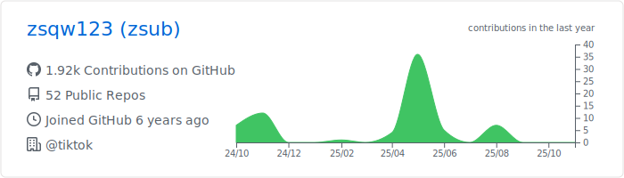
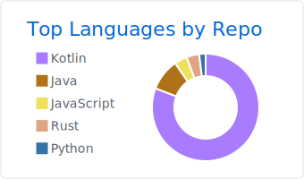
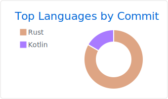
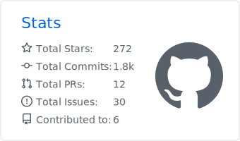

| :warning: | If your workflow does not generate all cards in output folder, then you need to use [Personal access token](https://docs.github.com/en/actions/configuring-and-managing-workflows/creating-and-storing-encrypted-secrets) instead of GITHUB_TOKEN in workflow. |
| :-------: | :------------------------------------------------------------------------------------------------------------------------------------------------------------------------------------------------------------------------------------------------ |

[Creating a personal access token
](https://docs.github.com/en/github/authenticating-to-github/creating-a-personal-access-token)

[Personal token permissions](https://github.com/vn7n24fzkq/github-profile-summary-cards/wiki/Personal-access-token-permissions)

| :warning: | Don't forget to modify the image path (The correct path is in `profile-summary-card-output` folder). |
| :-------: | :-------------------------------------------------------------------------------------------------------- |

[More Info](https://github.com/vn7n24fzkq/github-profile-summary-cards)

